# 论文检索逻辑分析报告

**生成时间**: 2025-11-14 02:01:27  
**项目**: arxiv-paper-curator  
**任务**: 检查论文检索相关逻辑是否实现

---

## 📊 总体概况

✅ **检索功能已实现**  
⚠️ **发现文件名不匹配问题**

---

## 🔍 详细分析

### 1. 论文抓取逻辑 ✅

**文件**: `arxiv-paper-curator/src/scripts/fetch_daily_papers_100percent.py`

**核心功能**:
- ✅ 100% 完整性保证的论文抓取
- ✅ 增量获取（避免重复）
- ✅ 断点续传（程序崩溃后可恢复）
- ✅ 完整性验证（对比 total_results）
- ✅ 多次验证（连续3次确认）
- ✅ 无限重试（直到成功或超时）

**保存格式**:
```
papers_data/papers_YYYY-MM-DD_100percent.json
```

**数据结构**:
```json
{
  "metadata": {
    "fetch_mode": "100_percent_complete",
    "fetch_date": "2025-11-13T18:30:00",
    "paper_date": "2025-11-12",
    "total_papers": 2385,
    "completeness_status": "100_COMPLETE",
    "categories": { ... }
  },
  "papers": [
    {
      "arxiv_id": "2411.12345",
      "title": "...",
      "authors": [...],
      "abstract": "...",
      "categories": ["cs.AI"],
      "published_date": "2025-11-12",
      "url": "https://arxiv.org/abs/2411.12345",
      "pdf_url": "https://arxiv.org/pdf/2411.12345.pdf"
    }
  ]
}
```

---

### 2. 论文加载逻辑 ✅

**文件**: `frontend/streamlit_app.py`

**核心函数**: `load_papers_from_json` (第 52-69 行)

```python
def load_papers_from_json(date_str: str) -> List[Dict]:
    """从JSON文件加载指定日期的论文数据"""
    data_path = Path(DATA_DIR)
    json_file = data_path / f"papers_{date_str}.json"
    
    if not json_file.exists():
        return []
    
    try:
        with open(json_file, 'r', encoding='utf-8') as f:
            papers = json.load(f)
            return papers if isinstance(papers, list) else []
    except Exception as e:
        st.error(f"Error loading papers from {json_file}: {e}")
        return []
```

**功能**:
- ✅ 从 JSON 文件加载论文数据
- ✅ 错误处理
- ✅ 返回论文列表

---

### 3. 论文检索逻辑 ✅

**文件**: `frontend/streamlit_app.py`

**核心函数**: `search_papers` (第 93-112 行)

```python
def search_papers(query: str, papers: List[Dict]) -> List[Dict]:
    """
    在论文中搜索（搜索标题和摘要）
    简单的字符串匹配实现
    """
    if not query:
        return papers
    
    query_lower = query.lower()
    results = []
    
    for paper in papers:
        title = paper.get("title", "").lower()
        abstract = paper.get("abstract", "").lower()
        
        # 简单的字符串匹配
        if query_lower in title or query_lower in abstract:
            results.append(paper)
    
    return results
```

**检索特性**:
- ✅ 搜索标题和摘要
- ✅ 大小写不敏感
- ✅ 支持子字符串匹配
- ✅ 实时搜索

**使用场景** (第 326-336 行):
```python
if search_query and search_query.strip():
    search_results = search_papers(search_query, filtered_papers)
    
    if not search_results:
        st.warning(f"📭 No results found for query: '{search_query}'")
    else:
        st.success(f"🔍 Found {len(search_results)} results for '{search_query}' in {date_str}")
        
        # 显示搜索结果
        for paper in search_results:
            render_paper_card(paper)
```

---

### 4. 分类过滤逻辑 ✅

**核心函数**: `filter_papers_by_categories` (第 72-90 行)

```python
def filter_papers_by_categories(papers: List[Dict], categories: List[str]) -> List[Dict]:
    """根据选择的分类过滤论文"""
    if not categories:
        return papers
    
    # 转换分类名称为代码
    category_codes = [ARXIV_CATEGORIES.get(cat, cat) for cat in categories]
    
    filtered = []
    for paper in papers:
        paper_categories = paper.get("categories", [])
        if isinstance(paper_categories, str):
            paper_categories = [paper_categories]
        
        # 检查论文是否属于任一选中的分类
        if any(cat in paper_categories for cat in category_codes):
            filtered.append(paper)
    
    return filtered
```

**功能**:
- ✅ 支持多分类过滤
- ✅ 支持分类代码和名称
- ✅ 灵活的数据格式处理

---

## ⚠️ 发现的问题

### 🔴 文件名格式不匹配

**问题描述**:

1. **抓取脚本保存的文件名**:
   ```
   papers_YYYY-MM-DD_100percent.json
   例如: papers_2025-11-13_100percent.json
   ```

2. **Streamlit 加载的文件名**:
   ```
   papers_YYYY-MM-DD.json
   例如: papers_2025-11-13.json
   ```

**影响**:
- ❌ Streamlit 无法加载抓取脚本保存的论文数据
- ❌ 会显示 "No papers found for date" 错误

**解决方案**:

#### 方案 1: 修改 Streamlit 加载逻辑（推荐）

修改 `frontend/streamlit_app.py` 的 `load_papers_from_json` 函数：

```python
def load_papers_from_json(date_str: str) -> List[Dict]:
    """从JSON文件加载指定日期的论文数据"""
    data_path = Path(DATA_DIR)
    
    # 优先尝试加载 100percent 版本
    json_file_100 = data_path / f"papers_{date_str}_100percent.json"
    json_file_normal = data_path / f"papers_{date_str}.json"
    
    # 选择存在的文件
    if json_file_100.exists():
        json_file = json_file_100
    elif json_file_normal.exists():
        json_file = json_file_normal
    else:
        return []
    
    try:
        with open(json_file, 'r', encoding='utf-8') as f:
            data = json.load(f)
            
            # 处理两种数据格式
            if isinstance(data, list):
                # 直接是论文列表
                return data
            elif isinstance(data, dict) and "papers" in data:
                # 包含 metadata 的格式
                return data["papers"]
            else:
                return []
    except Exception as e:
        st.error(f"Error loading papers from {json_file}: {e}")
        return []
```

#### 方案 2: 修改抓取脚本保存逻辑

修改 `fetch_daily_papers_100percent.py` 的 `save_papers_with_metadata` 函数：

```python
# 修改第 342 行
output_file = self.output_dir / f"papers_{date_str}.json"  # 移除 _100percent 后缀
```

但这样会丢失 100percent 标识，不推荐。

#### 方案 3: 创建软链接

```bash
cd papers_data
ln -s papers_2025-11-13_100percent.json papers_2025-11-13.json
```

---

## 📈 检索功能评估

### ✅ 已实现的功能

| 功能 | 状态 | 说明 |
|------|------|------|
| 标题搜索 | ✅ | 支持子字符串匹配 |
| 摘要搜索 | ✅ | 支持子字符串匹配 |
| 大小写不敏感 | ✅ | 自动转为小写 |
| 分类过滤 | ✅ | 支持多分类选择 |
| 实时搜索 | ✅ | 输入即搜索 |
| 结果显示 | ✅ | 显示匹配数量和论文卡片 |

### 🔄 可优化的功能

| 功能 | 优先级 | 说明 |
|------|--------|------|
| 关键词高亮 | 中 | 在结果中高亮显示匹配的关键词 |
| 模糊搜索 | 中 | 支持拼写错误容错 |
| 多关键词搜索 | 中 | 支持 AND/OR 逻辑 |
| 作者搜索 | 低 | 扩展搜索到作者字段 |
| 正则表达式 | 低 | 高级用户功能 |
| 全文搜索索引 | 低 | 对于大量论文的性能优化 |

---

## 🎯 使用流程

### 完整工作流程

```mermaid
graph LR
    A[运行抓取脚本] --> B[保存到 papers_data/]
    B --> C[Streamlit 加载 JSON]
    C --> D[用户选择日期和分类]
    D --> E[过滤论文]
    E --> F[用户输入搜索词]
    F --> G[检索匹配论文]
    G --> H[显示结果]
```



### 1. 抓取论文

```bash
cd /workspace/arxiv-paper-curator

# 抓取昨天的论文（默认）
python -m src.scripts.fetch_daily_papers_100percent

# 抓取特定日期
python -m src.scripts.fetch_daily_papers_100percent --date 2025-11-13

# 只抓取特定分类
python -m src.scripts.fetch_daily_papers_100percent --categories cs.AI cs.LG
```

### 2. 运行 Streamlit

```bash
cd /workspace/frontend

# 设置数据目录（如果不在默认位置）
export DATA_DIR=/workspace/arxiv-paper-curator/papers_data

# 运行 Streamlit
streamlit run streamlit_app.py
```

### 3. 使用检索

1. 选择日期（使用日期选择器）
2. 选择感兴趣的分类（侧边栏）
3. 输入搜索关键词（可选）
4. 查看匹配的论文

---

## 🛠️ 修复建议

### 立即修复（高优先级）

1. **修复文件名不匹配问题**
   - 实施方案 1（修改 Streamlit 加载逻辑）
   - 同时支持两种文件名格式
   - 优先加载 100percent 版本

### 代码示例

```python
# 在 streamlit_app.py 中更新 load_papers_from_json 函数

def load_papers_from_json(date_str: str) -> List[Dict]:
    """
    从JSON文件加载指定日期的论文数据
    支持两种文件格式:
    1. papers_YYYY-MM-DD_100percent.json (优先)
    2. papers_YYYY-MM-DD.json (备选)
    """
    data_path = Path(DATA_DIR)
    
    # 尝试两种文件名格式
    json_files = [
        data_path / f"papers_{date_str}_100percent.json",
        data_path / f"papers_{date_str}.json",
    ]
    
    for json_file in json_files:
        if json_file.exists():
            try:
                with open(json_file, 'r', encoding='utf-8') as f:
                    data = json.load(f)
                    
                    # 处理不同的数据格式
                    if isinstance(data, list):
                        # 直接是论文列表
                        return data
                    elif isinstance(data, dict):
                        # 包含 metadata 的格式
                        if "papers" in data:
                            return data["papers"]
                        else:
                            # 可能是单个论文对象
                            return [data]
                    else:
                        st.warning(f"Unexpected data format in {json_file}")
                        return []
                        
            except json.JSONDecodeError as e:
                st.error(f"Invalid JSON in {json_file}: {e}")
                continue
            except Exception as e:
                st.error(f"Error loading papers from {json_file}: {e}")
                continue
    
    # 没有找到任何文件
    return []
```

---

## 📝 总结

### ✅ 检索逻辑实现情况

**已完整实现**:
1. ✅ 论文数据加载（从 JSON 文件）
2. ✅ 分类过滤（支持多分类选择）
3. ✅ 关键词搜索（标题+摘要）
4. ✅ 结果展示（论文卡片形式）

### ⚠️ 需要修复的问题

**紧急**:
1. 🔴 文件名格式不匹配（导致无法加载数据）

**建议**:
1. 🟡 增强搜索功能（关键词高亮、多关键词支持）
2. 🟡 改善用户体验（搜索历史、保存偏好）

### 🎓 技术栈

- **后端抓取**: Python + asyncio + ArxivClient
- **数据存储**: JSON 文件
- **前端展示**: Streamlit
- **搜索算法**: 简单字符串匹配（适合小规模数据）

### 🚀 下一步

1. **立即修复文件名不匹配问题**（按照上述代码示例）
2. 测试端到端流程
3. 考虑增强搜索功能（如需要）

---

**报告完成时间**: 2025-11-14 02:01:27  
**状态**: ✅ 检索逻辑已实现 | ⚠️ 需修复文件名不匹配问题
